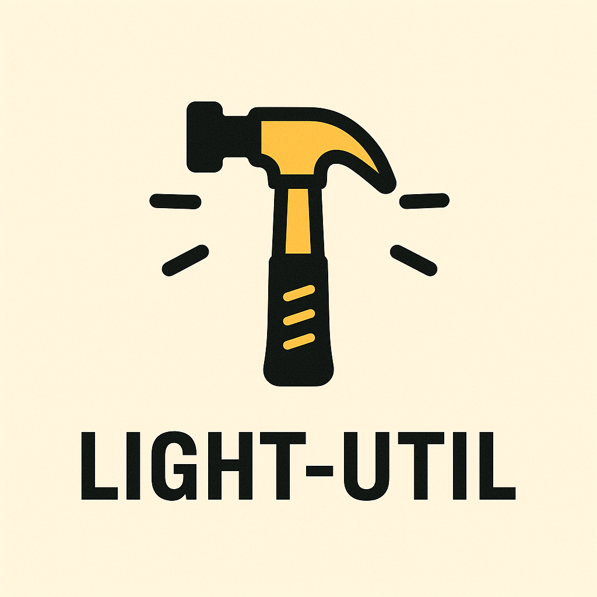

<a id="readme-top"></a>

<!-- PROJECT LOGO -->
<br />
<div align="center">
  <a href="https://github.com/zzhdbw/light-util">
    
  </a>

  <h3 align="center">light-util</h3>

  <p align="center">
    An light util for python development !
    <br />
  </p>
</div>


<!-- TABLE OF CONTENTS -->
<details>
  <summary>Table of Contents</summary>
  <ol>
    <li>
      <a href="#about-the-project">About The Project</a>
    </li>
    <li>
      <a href="#getting-started">Getting Started</a>
      <ul>
        <li><a href="#installation">Installation</a></li>
      </ul>
    </li>
    <li><a href="#usage">Usage</a></li>
    <li><a href="#license">License</a></li>
    <li><a href="#contact">Contact</a></li>
  </ol>
</details>


<!-- ABOUT THE PROJECT -->
## About The Project

light-util is a library that provides lightweight tools for Python development.

<p align="right">(<a href="#readme-top">back to top</a>)</p>

<!-- GETTING STARTED -->
## Getting Started
You can use it easyly.

### Installation

You can install it from pypi by pip.
```
pip install light-util
```
<p align="right">(<a href="#readme-top">back to top</a>)</p>

<!-- USAGE EXAMPLES -->
## Usage

light-util can be used for both synchronous and asynchronous functions.  
You can easily use light-util with a decorator.
```
from light_util import get_time
import time
import asyncio

if __name__ == "__main__":
    @get_time
    async def async_example_function(n):
        time.sleep(2)  # Simulate a delay
        # raise ValueError("An example error")
        return 1
    
    @get_time
    def example_function(n):
        time.sleep(2)  # Simulate a delay
        # raise ValueError("An example error") 
        return 1
    
    import asyncio
    asyncio.run(async_example_function(1000000))    
    example_function(1000000)
    # function [async_example_function] execution elapsed: 2.002s
    # function [example_function] execution elapsed: 2.002s
```

<p align="right">(<a href="#readme-top">back to top</a>)</p>


<!-- LICENSE -->
## License

Distributed under the Unlicense License. See `LICENSE` for more information.

<p align="right">(<a href="#readme-top">back to top</a>)</p>


<!-- CONTACT -->
## Contact

Zhihao Zhang - 2578503482@qq.com

Project Link: [https://github.com/zzhdbw/light-util](https://github.com/zzhdbw/light-util)

<p align="right">(<a href="#readme-top">back to top</a>)</p>


